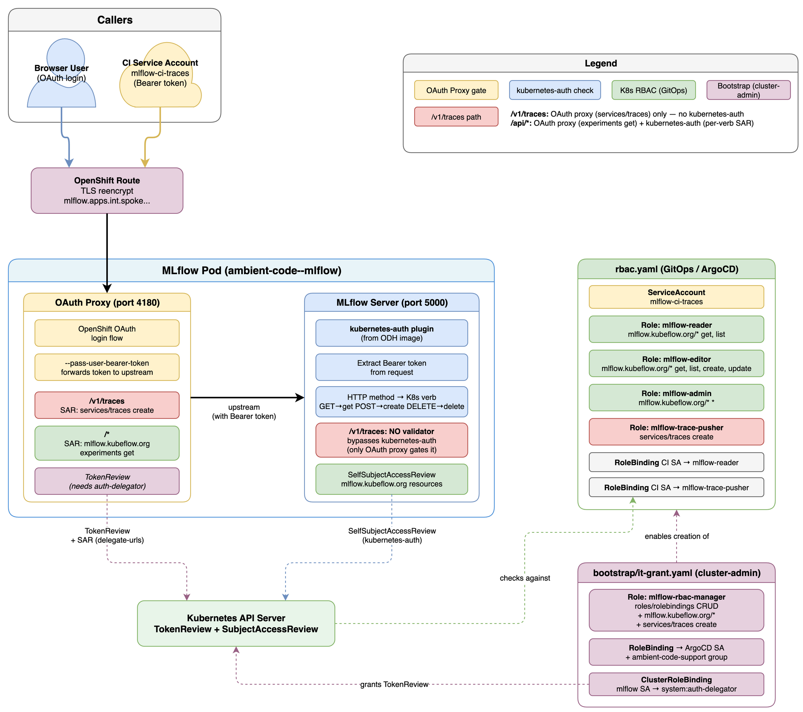

# Architecture

## Authorization flow

### Two auth layers

1. **OAuth Proxy** (sidecar, port 4180) — handles browser login via OpenShift OAuth and forwards the user's Bearer token to MLflow. Enforces two delegate-urls gates:
   - `/v1/traces` → SAR check: `services/traces create` (CI trace ingestion)
   - `/` → SAR check: `mlflow.kubeflow.org/experiments get` (general access)

2. **MLflow kubernetes-auth** (plugin) — validates the Bearer token via Kubernetes SelfSubjectAccessReview, mapping HTTP methods to K8s verbs (`GET→get`, `POST→create`, `DELETE→delete`) against resources in the `mlflow.kubeflow.org` API group. The `/v1/traces` OTLP endpoint has no validator and is only gated by the OAuth proxy.

### Request paths

| Path | Auth layer | Description |
|------|-----------|-------------|
| Browser → UI | OAuth proxy (login) + kubernetes-auth | Full RBAC per resource |
| CI → `/v1/traces` | OAuth proxy (`services/traces create`) | Trace ingestion only |
| CI → `/api/2.0/mlflow/*` | OAuth proxy + kubernetes-auth | Experiment lookup |

### RBAC resources

**Managed by ArgoCD** (`rbac.yaml`):
- Shared roles: `mlflow-reader`, `mlflow-editor`, `mlflow-admin`, `mlflow-trace-pusher`
- CI service account (`mlflow-ci-traces`) bindings

**Managed by ArgoCD** (`experiments/*.yaml`):
- Per-experiment scoped roles (via `resourceNames`)
- Maintainer RoleBindings

**Applied by cluster-admin** (`bootstrap/it-grant.yaml`):
- `mlflow-rbac-manager` Role + RoleBinding (grants ArgoCD + namespace admins the permissions needed to manage the MLflow RBAC roles)
- `system:auth-delegator` ClusterRoleBinding (OAuth proxy TokenReview)

### Pod namespace fallback

The kubernetes-auth plugin normally requires workspaces to determine the namespace for SAR checks. The patched image includes a fallback that reads the pod's own namespace from `/var/run/secrets/kubernetes.io/serviceaccount/namespace` when workspaces are disabled, allowing single-tenant deployments to work without `--enable-workspaces`.
